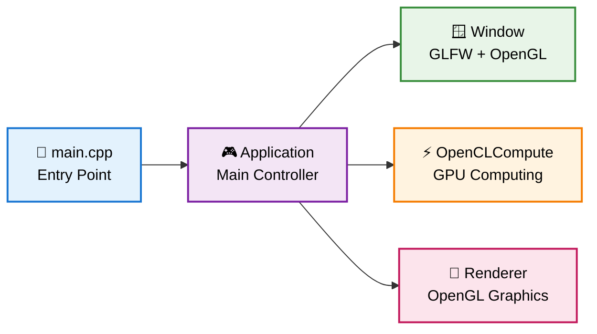
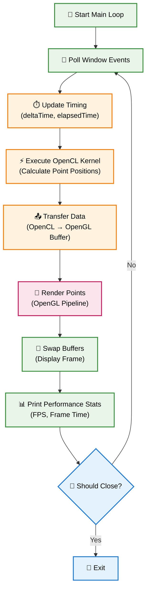

# OpenCL Visualization Project

A real-time visualization application that uses OpenCL for parallel computing and OpenGL for rendering. The project generates and animates points in a parametric pattern using GPU compute shaders.

## 🎯 Overview

This project demonstrates the integration between OpenCL (for parallel computing) and OpenGL (for graphics rendering) to create real-time mathematical visualizations. The system calculates point positions using parametric formulas on the GPU via OpenCL and renders them using OpenGL.

## 🏗️ System Architecture

### High-Level Overview



### Application Main Loop



## 🔧 Main Components
### 1. **Application** (Main Controller)
- Manages application lifecycle
- Coordinates Window, OpenCLCompute and Renderer
- Controls timing and performance statistics
- Executes the main rendering loop

### 2. **Window** (Window Management)
- GLFW wrapper
- Window creation and management
- OpenGL context
- Event handling

### 3. **OpenCLCompute** (Parallel Computing)
- OpenCL platform initialization
- Kernel compilation and execution
- OpenCL buffer management
- Parallel point position calculation

### 4. **Renderer** (OpenGL Rendering)
- OpenGL buffer management (VBO/VAO)
- Shader compilation
- Rendering pipeline
- GPU data updates

## 🚀 Execution Flow

1. **Initialization**: 
   - Application setup via `Application::Config`
   - GLFW window creation
   - OpenCL context initialization
   - OpenGL buffers and shaders setup

2. **Main Loop**:
   - **Events**: Process window events
   - **Timing**: Update delta and elapsed time
   - **Compute**: Execute OpenCL kernel to calculate new positions
   - **Transfer**: Copy data from OpenCL to OpenGL
   - **Render**: Render points on screen
   - **Display**: Swap buffers and show frame
   - **Stats**: Print performance statistics

3. **OpenCL Kernel** (`fill_points.cl`):
   ```opencl
   // Animated parametric formula
   x = 0.8 * cos(4π * (a*u + 0.1*t))
   y = 0.8 * sin(2π * (b*u + 0.2*t))
   ```

## 📋 Requirements

- **OpenCL**: For parallel computing
- **OpenGL**: For rendering
- **GLFW**: For window creation
- **GLEW**: For OpenGL extensions
- **CMake**: For build system

## 🏃‍♂️ How to Run

```bash
# Build the project
./build.sh

# Run
./run.sh
# or
./build/visProject
```

## ⚙️ Configuration

Main settings are in `main.cpp`:

```cpp
Application::Config config;
config.windowWidth = 1366;
config.windowHeight = 768;
config.pointCount = 1200000;  // Number of points
config.vsync = false;
config.kernelPath = "../kernels/fill_points.cl";
config.vertexPath = "../shaders/vertex_1.glsl";
config.fragmentPath = "../shaders/fragment_1.glsl";
```

## 📊 Performance

The system monitors and displays in real-time:
- **FPS**: Frames per second
- **Frame Time**: Time per frame in milliseconds
- **Elapsed Time**: Total elapsed time

## 🎨 Customization

- **Patterns**: Modify `fill_points.cl` for different parametric equations
- **Shaders**: Customize `vertex_1.glsl` and `fragment_1.glsl` for different visual effects
- **Points**: Adjust `pointCount` for more/less density
- **Animation**: Modify time parameters in the kernel

## 🏗️ File Structure

```
├── src/
│   ├── main.cpp           # Entry point
│   ├── application.cpp    # Main controller
│   ├── window.cpp         # GLFW management
│   ├── compute.cpp        # OpenCL compute
│   ├── renderer.cpp       # OpenGL rendering
│   └── common.cpp         # Utilities
├── include/               # Headers
├── shaders/              # GLSL shaders
├── kernels/              # OpenCL kernels
└── build/                # Compiled files
```

## 🎯 Technical Features

- **Parallel Computing**: Up to 1.2M gravitational interactions calculated simultaneously per second on GPU (using current kernel with direct sumation)
- **Efficient Rendering**: Direct use of OpenGL vertex buffers
- **Synchronization**: Optimized transfer between OpenCL and OpenGL
- **Real-time**: 60+ FPS with smooth visualization using $10^5$ points with medium grade GPUs
